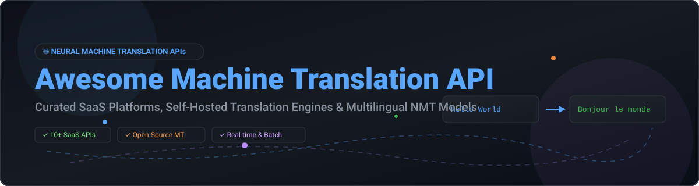

# 🌐 Awesome Machine Translation API 🚀

  
  
  
  
  

## 📌 Top Machine Translation API Platforms & Open-Source NMT Ecosystem

> **Curated List of SaaS Products & Open-Source GitHub Projects** for Neural Machine Translation (NMT), Multilingual APIs, Self-Hosted Translation Engines, and Global Localization Pipelines.

**Last updated:** October 2026

---

## 💡 Overview & Market Landscape

This repository tracks notable **SaaS platforms** and **open-source projects** for **Machine Translation (MT) APIs**. These services and neural translation engines provide programmatic access to high-quality text, document, and real-time speech translation across hundreds of languages, powering modern software localization, content pipelines, global chat applications, and cross-border e-commerce.

### 📊 Sector Market Size & Industry Structure
- **Estimated Market Size:** The global Machine Translation market is valued at **~$1.4 Billion USD (2026)** and is projected to expand to **$3.8+ Billion USD by 2032** at a CAGR of ~18.5%.
- **Market Structure:** The sector is **moderately fragmented with clear cloud oligopoly leaders**. Broad cloud platform giants (Google, Microsoft, AWS) and specialized translation specialists (DeepL, Systran, ModernMT) hold significant market share for commercial enterprise APIs, while an active open-source ecosystem (LibreTranslate, Meta NLLB, Hugging Face) provides self-hosted alternatives for privacy-focused and air-gapped deployments.

---

## 📑 Table of Contents

- [☁️ SaaS / Hosted Platforms](#-saas--hosted-platforms)
- [🔓 Open-Source GitHub Projects](#-open-source-github-projects)
- [🛠️ Additional Open-Source Options & Deployment Strategies](#%EF%B8%8F-additional-open-source-options--deployment-strategies)
- [🤝 How to Contribute](#-how-to-contribute)
- [💖 Support & Acknowledgments](#-support--acknowledgments)
- [📈 Star History](#-star-history)
- [⚠️ Disclaimer](#%EF%B8%8F-disclaimer)

---

## ☁️ SaaS / Hosted Platforms

Below is a comparison of leading enterprise and developer-focused commercial Machine Translation APIs, including company size, pricing tiers, and free plan limits.

*Sorted by Company Size / Enterprise Valuation (Descending)*

| SaaS Platform / API | Company Size (Rev / Val) 🏢 | Starting Pricing Tier 💰 | Free Tier / Trial Limit 🎁 | Description 📝 |
| :--- | :--- | :--- | :--- | :--- |
| **[Microsoft Translator](https://www.microsoft.com/translator/)** | ~$245B Annual Revenue (Microsoft) | **$15.00** per 1M characters (S1 Standard Tier) | **2.0 Million characters free per month** (F0 Free Tier) | Azure AI cloud translation API supporting 110+ languages, custom translation models, and asynchronous document translation. |
| **[Google Cloud Translation](https://cloud.google.com/translate)** | ~$307B Annual Revenue (Alphabet/Google) | **$20.00** per 1M characters (Basic / Advanced API) | **500,000 characters free per month** | Neural machine translation API with 130+ language coverage, custom glossaries, and seamless Google Cloud ecosystem integration. |
| **[AWS Translate](https://aws.amazon.com/translate/)** | ~$90B Annual Revenue (Amazon AWS Division) | **$15.00** per 1M characters | **2.0 Million characters per month for 12 months** (AWS Free Tier) | High-speed neural machine translation service integrated with AWS services, supporting real-time text and batch translation. |
| **[IBM Watson Language Translator](https://www.ibm.com/products/language-translator)** | ~$62B Annual Revenue (IBM) | **$0.02** per thousand characters (Standard Plan) | **1,000,000 characters free per month** (Lite Plan) | IBM Cloud translation service offering domain customization and multi-language support within the enterprise Watson ecosystem. |
| **[Baidu Translate API](https://fanyi-api.baidu.com/)** | ~$18B Annual Revenue (Baidu) | **49 RMB (~$7.00)** per 1M characters (Advanced Tier) | **50,000 characters free per month** (Standard Developer Plan) | Baidu's translation API featuring deep language support for Asian language pairs, real-time web REST API, and domain engines. |
| **[Yandex Translate API](https://yandex.com/dev/translate/)** | ~$10B Annual Revenue (Yandex Group) | **$15.00** per 1M characters | **$300 free trial credits valid for 60 days** | Yandex Cloud REST translation API providing fast NMT for Russian, Eastern European, and global language pairs. |
| **[DeepL API](https://www.deepl.com/pro-api)** | ~$2.0B Valuation (Unicorn Status) | **$5.49 / month** + **$25.00** per 1M characters (DeepL API Pro) | **500,000 characters free per month** (DeepL API Free) | Industry benchmark for natural-sounding European & global language translation with formal/informal tone controls. |
| **[Systran](https://www.systransoft.com/)** | ~$50M Annual Revenue | **$15.00 / month** (Systran Translate Pro Basic) | **14-day free trial** (Includes 150,000 characters) | Enterprise-grade translation engine provider offering specialized domain adaptation, on-premise security, and API access. |
| **[Translated](https://translated.com/)** | ~$45M Annual Revenue | **$0.003** per word (ModernMT API Integration) | **$30 free credit trial** for API testing | Professional localization provider offering hybrid AI + human translation workflows and enterprise MT integrations. |
| **[ModernMT](https://www.modernmt.com/)** | ~$15M Valuation | **$15.00** per 1M characters (Pay-as-you-go Plan) | **100,000 characters free per month** | Real-time adaptive machine translation platform that dynamically learns from translation memory and user corrections. |

---

## 🔓 Open-Source GitHub Projects

Explore self-hosted, offline-capable, and open-weights Machine Translation frameworks and pre-trained models.

*Sorted by GitHub Star Count (Descending)*

| Repository | GitHub Stars ⭐ | Key Focus & Description 📝 |
| :--- | :--- | :--- |
| **[huggingface/transformers](https://github.com/huggingface/transformers)** |  | State-of-the-art machine learning framework hosting ready-to-use NMT translation pipelines (OPUS-MT, NLLB, M2M-100, Marian). |
| **[facebookresearch/fairseq](https://github.com/facebookresearch/fairseq)** |  | Meta AI's sequence-to-sequence toolkit powering flagship translation research models including NLLB-200 and M2M-100. |
| **[LibreTranslate/LibreTranslate](https://github.com/LibreTranslate/LibreTranslate)** |  | Free, self-hosted, and 100% open-source machine translation API engine powered by Argos Translate; offline-capable and API-compatible. |
| **[facebookresearch/seamless_communication](https://github.com/facebookresearch/seamless_communication)** |  | Meta AI's foundational open-source models for expressive multi-lingual speech and text translation across 100+ languages. |
| **[OpenNMT/OpenNMT-py](https://github.com/OpenNMT/OpenNMT-py)** |  | Open-source neural machine translation framework in PyTorch designed for production model training, research, and domain adaptation. |
| **[argosopentech/argos-translate](https://github.com/argosopentech/argos-translate)** |  | Open-source Python neural translation library and CTranslate2 engine backing LibreTranslate desktop and web services. |
| **[OpenNMT/CTranslate2](https://github.com/OpenNMT/CTranslate2)** |  | Optimized C++ and Python inference engine for Transformer models, achieving fast NMT execution on CPU and GPU. |
| **[marian-nmt/marian](https://github.com/marian-nmt/marian)** |  | Efficient Neural Machine Translation framework written in C++ with minimal dependencies, power behind Microsoft Translator & OPUS-MT. |
| **[Apertium/apertium](https://github.com/Apertium/apertium)** |  | Rule-based machine translation engine (RBMT) designed for low-resource language pairs and structural linguistic precision. |
| **[Helsinki-NLP/OPUS-MT-train](https://github.com/Helsinki-NLP/OPUS-MT-train)** |  | Training pipeline for 1,000+ open-source translation models trained on the OPUS parallel corpus by Helsinki NLP. |
| **[LibreTranslate/Locomotive](https://github.com/LibreTranslate/Locomotive)** |  | Community toolkit for training, converting, and packaging OpenNMT models for LibreTranslate and Argos Translate compatibility. |

---

## 🛠️ Additional Open-Source Options & Deployment Strategies

- 🐳 **Self-Hosting LibreTranslate:** Run via Docker in minutes (`docker run -p 5000:5000 libretranslate/libretranslate`) for a privacy-focused REST API.
- ⚡ **Lightweight Local Inference:** Use **Argos Translate** or **CTranslate2** in Python/C++ microservices for zero-latency desktop or edge translation.
- 🌍 **Massive Multilingual Models:** Deploy **Meta NLLB-200** or **M2M-100** via Hugging Face Transformers for 200+ direct language pair translations without English pivot bias.
- 🎯 **Custom Domain Fine-Tuning:** Train custom Transformer models with **OpenNMT-py** or **Marian** when translating specialized medical, legal, or technical copy.

---

## 🤝 How to Contribute

Contributions are highly welcome! To submit a new SaaS platform or Open-Source NMT project:

1. 🍴 **Fork** this repository.
2. 📝 **Add/edit** entries in `README.md` maintaining table formats and verified pricing/star links.
3. 🔍 Ensure descriptions remain factual, neutral, and concise.
4. 🚀 **Submit a Pull Request** with a summary of changes.

---

## 💖 Support & Acknowledgments

If this repository helped you find the right Machine Translation API or self-hosted engine for your project, please consider:
- ⭐ **Starring** this repository on GitHub to boost visibility!
- 🔀 **Sharing** it with fellow developers, localization engineers, and NLP researchers.
- ☕ **Supporting the maintainer** via [GitHub Sponsors](https://github.com/sponsors/ishandutta2007)!

  

---

## 📈 Star History

---

## ⚠️ Disclaimer

- This repository is a **community-curated index** for informational and educational purposes.
- Machine Translation quality varies across language pairs, domains, and model architectures.
- Open-source models may require custom fine-tuning to reach commercial engine accuracy on specialized jargon.

---

  <b>Made with ❤️ for developers, localization engineers, and open NLP technology advocates.</b>

